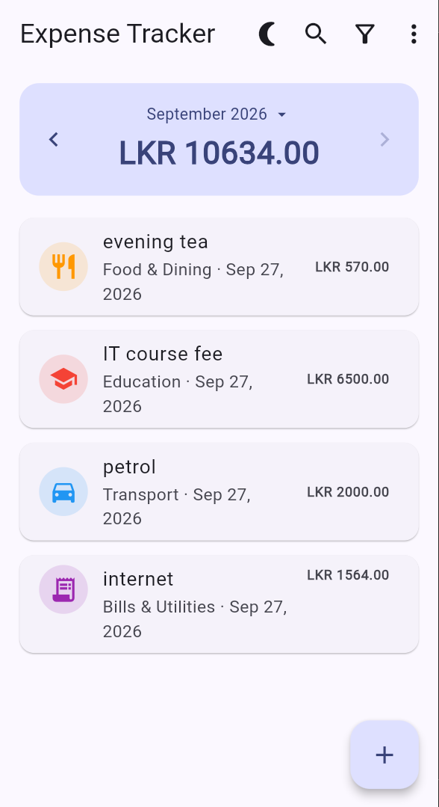
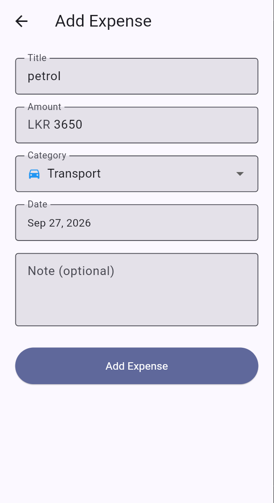
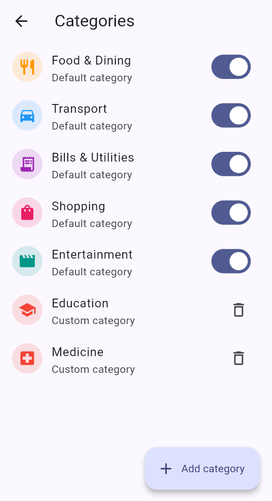
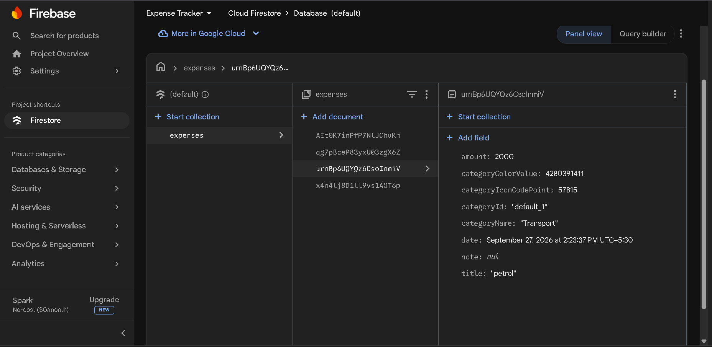

# Expense Tracker

A clean and modern **Flutter expense tracking application** built with **Provider** and **Firebase Cloud Firestore**.

This project was developed as a practical task for the **CyphLab Flutter Developer Internship**.

The application allows users to manage expenses, organize them by category, view monthly spending summaries, search and filter expense history, and visualize spending by category.

---

## 📱 Screenshots

| Home | Add / Edit Expense |
|:---:|:---:|
|  |  |

| Manage Categories | Firestore Database |
|:---:|:---:|
|  |  |

---

## ✨ Features

### Expense Management

* Add new expenses
* Edit existing expenses
* Delete expenses
* Expense title, amount, category, date, and optional note
* Form validation for required fields and valid amounts

### Categories

* Five default categories:

  * Food & Dining
  * Transport
  * Bills & Utilities
  * Shopping
  * Entertainment
* Add custom categories
* Disable default categories instead of permanently deleting them
* Delete custom categories
* Custom category colors and icons

### Search & Filtering

* Search expenses by title or note
* Filter by category
* Filter by date
* View complete expense history
* Expenses are ordered by date

### Monthly Tracking

* View total spending for the selected month
* Select month and year
* Previous / next month navigation
* Reset to the current month

### Visualization

* Pie chart showing spending by category
* Chart updates according to the selected month

### UI & UX

* Material 3 design
* Light and dark themes
* Manual theme toggle
* Responsive layouts
* Safe-area support
* Loading states
* Empty states
* Error states

### Cloud Storage

* Expenses are stored in **Cloud Firestore**
* Real-time expense stream
* Changes are reflected in the UI automatically
* CRUD operations are asynchronous

---

## 🧩 Tech Stack

| Technology          | Purpose                                      |
| ------------------- | -------------------------------------------- |
| **Flutter / Dart**  | Mobile application framework                 |
| **Provider**        | State management                             |
| **Firebase Core**   | Firebase initialization                      |
| **Cloud Firestore** | Cloud database and real-time synchronization |
| **FL Chart**        | Category spending visualization              |
| **Intl**            | Date formatting and date-related utilities   |
| **FlutterFire CLI** | Firebase configuration                       |

**Platform:** Android

---

## 🏗️ Application Architecture

The application follows a simple layered architecture:

```text
┌──────────────────────────────┐
│            UI                │
│  Screens + Reusable Widgets  │
└──────────────┬───────────────┘
               │
               ▼
┌──────────────────────────────┐
│          Providers           │
│ Expense / Category / Theme   │
└──────────────┬───────────────┘
               │
               ▼
┌──────────────────────────────┐
│           Services           │
│      FirestoreService        │
└──────────────┬───────────────┘
               │
               ▼
┌──────────────────────────────┐
│       Firebase Firestore     │
│         expenses             │
└──────────────────────────────┘
```

### Expense Data Flow

```text
Firestore
    │
    │ Real-time stream
    ▼
FirestoreService
    │
    ▼
ExpenseProvider
    │
    ├── Search
    ├── Category filtering
    ├── Date filtering
    ├── Month filtering
    └── Monthly totals
    │
    ▼
Flutter UI
```

---

## 🗂️ Project Structure

```text
lib/
├── main.dart
├── firebase_options.dart
│
├── models/
│   ├── expense.dart
│   └── category.dart
│
├── services/
│   └── firestore_service.dart
│
├── providers/
│   ├── expense_provider.dart
│   ├── category_provider.dart
│   └── theme_provider.dart
│
├── screens/
│   ├── home/
│   │   ├── home_screen.dart
│   │   └── widgets/
│   │       ├── month_summary_card.dart
│   │       ├── expense_list_item.dart
│   │       ├── filter_sheet.dart
│   │       └── month_picker.dart
│   │
│   ├── add_edit_expense/
│   │   └── add_edit_expense_screen.dart
│   │
│   ├── manage_categories/
│   │   └── manage_categories_screen.dart
│   │
│   └── chart/
│       └── category_chart_screen.dart
│
├── widgets/
│   ├── empty_state.dart
│   ├── loading_view.dart
│   └── error_view.dart
│
└── utils/
    ├── theme.dart
    └── constants.dart
```

---

## ☁️ Firebase & Firestore

The application uses **Cloud Firestore** as its backend database.

### Expenses Collection

Expenses are stored in:

```text
expenses/
```

Each expense document contains fields similar to:

```text
title
amount
categoryName
categoryColorValue
categoryIconCodePoint
date
note
```

### Category Snapshotting

Categories are intentionally kept **in-memory** using `CategoryProvider` rather than stored as a separate Firestore collection.

When an expense is saved, the current category information is copied into the expense document:

```text
categoryName
categoryColorValue
categoryIconCodePoint
```

This means historical expenses retain the category appearance they had when they were created.

For example:

```text
Expense
 ├── title: "Lunch"
 ├── amount: 1200
 ├── categoryName: "Food & Dining"
 ├── categoryColorValue: ...
 └── categoryIconCodePoint: ...
```

If the category is later disabled or removed from the local category list, existing expenses can still display their original category information correctly.

---

## 🚀 Getting Started

### Prerequisites

Make sure you have:

* Flutter SDK
* Dart SDK
* Android Studio
* Android emulator or physical Android device
* Firebase account
* Node.js and npm
* Firebase CLI
* FlutterFire CLI

Check Flutter:

```bash
flutter --version
```

---

## 1. Clone the Repository

```bash
git clone https://github.com/<your-username>/expense-tracker-app-flutter.git
cd expense-tracker-app-flutter
```

Install Flutter dependencies:

```bash
flutter pub get
```

---

## 2. Configure Firebase

The recommended approach for anyone cloning this repository is to connect the application to **their own Firebase project**.

### Install Firebase CLI

```bash
npm install -g firebase-tools
```

Log in:

```bash
firebase login
```

### Install FlutterFire CLI

```bash
dart pub global activate flutterfire_cli
```

Make sure the FlutterFire executable directory is available in your system `PATH`.

### Configure the Flutter project

From the project root:

```bash
flutterfire configure
```

Select your Firebase project and the required platform:

```text
Android
```

FlutterFire will generate:

```text
lib/firebase_options.dart
android/app/google-services.json
```

---

## 3. Create Firestore Database

In the Firebase Console:

```text
Firebase Console
    ↓
Build
    ↓
Firestore Database
    ↓
Create Database
```

For development/testing, Firestore can initially be created in **Test Mode**.

Choose an appropriate database location and enable Firestore.

> **Important:** Test Mode allows broad access and should not be used for a production application. Configure proper Firestore security rules before deploying the application for real users.

---

## 4. Run the Application

Check connected devices:

```bash
flutter devices
```

Run on Android:

```bash
flutter run
```

Or specify an Android device:

```bash
flutter run -d <device-id>
```

---

## 5. Build Release APK

To generate a release APK:

```bash
flutter build apk --release
```

The generated APK will be available at:

```text
build/app/outputs/flutter-apk/app-release.apk
```

---

## 🔐 Security Considerations

This project currently uses Firebase Firestore in **development/test mode**.

There is currently:

* No Firebase Authentication
* No user-specific data isolation
* No production Firestore security rules

Therefore, the current Firebase configuration is intended for **development and demonstration purposes**.

Before production deployment, the application should implement:

* Firebase Authentication
* User-specific expense ownership
* Firestore security rules
* Proper access control
* Production Firebase configuration

---

## 🤖 AI Tools Used

**Claude AI** was used during development as a development assistance tool.

It was used for:

* Architecture and project structure planning
* Provider state-management implementation
* Firebase and Firestore integration guidance
* Debugging assistance
* Error handling guidance
* Reviewing implementation approaches

**ChatGPT** was used during the development process as a documentation assistance tool.

It was used for:

* Firebase and Firestore integration guidance
* Debugging and error-handling guidance
* Reviewing implementation approaches
* Documentation support, including preparing and refining the project README.


AI-generated suggestions and code were **reviewed, modified, tested, and integrated manually** as part of the development process.

---

## 📌 Current Version

**v2.0**

### v2.0 Highlights

* Firebase integration
* Cloud Firestore expense storage
* Real-time expense streaming
* Firestore CRUD operations
* ExpenseProvider integration
* Category snapshotting
* Cloud-backed expense management

---

## 🔮 Possible Future Improvements

* Firebase Authentication
* Expense pagination for large datasets
* Export expenses to CSV/PDF
* Budget management
* Recurring expenses
* More detailed analytics

---

## 👨‍💻 Developer

**Suranga Prabash**

Software Developer

* GitHub: [github.com/surangaprabash](https://github.com/surangaprabash)

---

## 📄 License

This project was created as part of a practical internship task for **CyphLab**.
